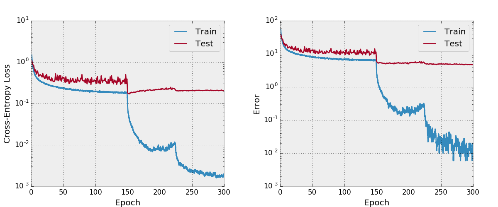
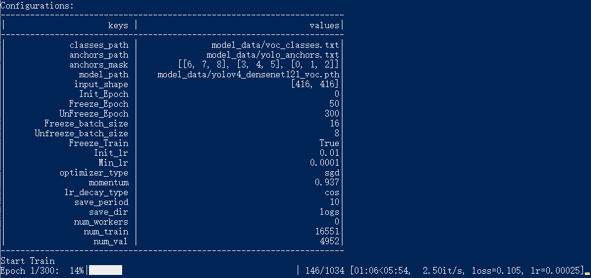
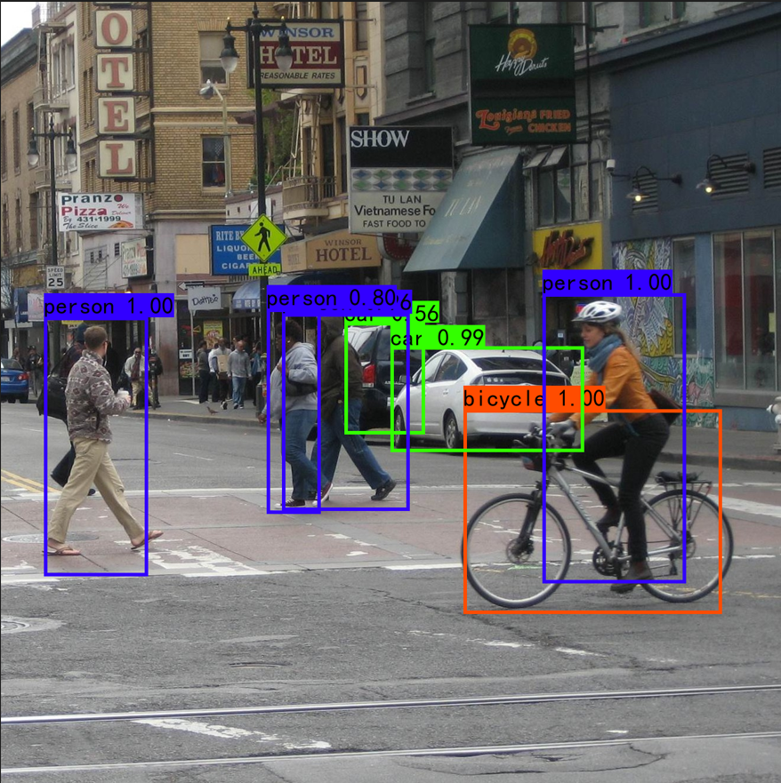

# 环境准备

推荐在linux系统准备环境，如果是win11可以考虑wsl2，详细请参考https://learn.microsoft.com/en-us/windows/wsl/install

1. 安装conda或miniconda
```
详细请参考https://anaconda.org.cn/anaconda/install/
```

2. 新建conda环境
```
CMD/POWERSHELL:
conda create --name your_env_name python=3.8
conda activate your_env_name
```
3. 安装PyTorch、CUDA (可选)

CPU版:
```
conda install pytorch torchvision torchaudio cpuonly -c pytorch
```

GPU版：

Nvidia 40系显卡安装PyTorch2.0+CUDA11.8
```
conda install pytorch torchvision torchaudio pytorch-cuda=11.8 -c pytorch -c nvidia
```
Nvidia 30系显卡安装PyTorch1.13.1+CUDA11.6
```
conda install pytorch==1.13.1 torchvision==0.14.0 torchaudio==0.13.0 pytorch-cuda=11.6 -c pytorch -c nvidia
```

GPU版最后需在NVIDIA官网上寻找对应的CUDA版本驱动安装，详细见https://developer.nvidia.com/cuda-toolkit-archive

# DenseNet架构

## 1. Torch的基本神经网络模块

* 卷积层
```{python}
torch.nn.Conv2d(in_channels, out_channels, kernel_size, stride, padding, dilation, groups)
```
| 参数 | 解释|
|:--- |:--- |
|in_channels | 输入通道数|
|out_channels | 输出通道数|
|kernel_size | 卷积核大小|
|stride | 步长|
|padding | 填充|
|dilation | 卷积核每个点之间的间隔|
|groups | 分组卷积|

*  批量归一化层
```{python}
torch.nn.BatchNorm2d(Channels)
```
在一个Batch内对里面的元素归一化

* ReLU激活函数
```{python}
torch.nn.function.relu(tensor)
```
$$
ReLU(x) = max(0, x)
$$

* 池化层
```{python}
torch.nn.function.avg_pool2d(tensor, kernel_size)
```
> 1x224x224 -> 1x(224//kernel_size)x(224//kernel_size) 

## 2. DenseNet

单层稠密连接
```{python}
class SingleLayer(nn.Module):
    def __init__(self, nChannels, growthRate):
        super(SingleLayer, self).__init__()
        self.bn1 = nn.BatchNorm2d(nChannels)
        self.conv1 = nn.Conv2d(nChannels, growthRate, kernel_size=3,
                               padding=1, bias=False)

    def forward(self, x):
        out = self.conv1(F.relu(self.bn1(x)))
        out = torch.cat((x, out), 1)
        return out

```

Bottleneck层
```{python}
class Bottleneck(nn.Module):
    def __init__(self, nChannels, growthRate):
        super(Bottleneck, self).__init__()
        interChannels = 4*growthRate
        self.bn1 = nn.BatchNorm2d(nChannels)
        self.conv1 = nn.Conv2d(nChannels, interChannels, kernel_size=1,
                               bias=False)
        self.bn2 = nn.BatchNorm2d(interChannels)
        self.conv2 = nn.Conv2d(interChannels, growthRate, kernel_size=3,
                               padding=1, bias=False)

    def forward(self, x):
        out = self.conv1(F.relu(self.bn1(x)))
        out = self.conv2(F.relu(self.bn2(out)))
        out = torch.cat((x, out), 1)
        return out
```

Compression 
$$nOutChannels = \theta * nChannels$$
```{python}
class Transition(nn.Module):
    def __init__(self, nChannels, nOutChannels):
        super(Transition, self).__init__()
        self.bn1 = nn.BatchNorm2d(nChannels)
        self.conv1 = nn.Conv2d(nChannels, nOutChannels, kernel_size=1,
                               bias=False)

    def forward(self, x):
        out = self.conv1(F.relu(self.bn1(x)))
        out = F.avg_pool2d(out, 2)
        return out
```

Densenet(depth=100, k=12)
```{python}
class DenseNet(nn.Module):
    def __init__(self, input_size, growthRate, depth, reduction, nClasses, bottleneck):
        super(DenseNet, self).__init__()

        self.input_size = input_size
        nDenseBlocks = (depth-4) // 3
        if bottleneck:
            nDenseBlocks //= 2

        nChannels = 2*growthRate
        self.conv1 = nn.Conv2d(3, nChannels, kernel_size=3, padding=1,
                               bias=False)
        self.dense1 = self._make_dense(nChannels, growthRate, nDenseBlocks, bottleneck)
        nChannels += nDenseBlocks*growthRate
        nOutChannels = int(math.floor(nChannels*reduction))
        self.trans1 = Transition(nChannels, nOutChannels)

        nChannels = nOutChannels
        self.dense2 = self._make_dense(nChannels, growthRate, nDenseBlocks, bottleneck)
        nChannels += nDenseBlocks*growthRate
        nOutChannels = int(math.floor(nChannels*reduction))
        self.trans2 = Transition(nChannels, nOutChannels)

        nChannels = nOutChannels
        self.dense3 = self._make_dense(nChannels, growthRate, nDenseBlocks, bottleneck)
        nChannels += nDenseBlocks*growthRate

        self.bn1 = nn.BatchNorm2d(nChannels)
        self.fc = nn.Linear(nChannels, nClasses)

        for m in self.modules():
            if isinstance(m, nn.Conv2d):
                n = m.kernel_size[0] * m.kernel_size[1] * m.out_channels
                m.weight.data.normal_(0, math.sqrt(2. / n))
            elif isinstance(m, nn.BatchNorm2d):
                m.weight.data.fill_(1)
                m.bias.data.zero_()
            elif isinstance(m, nn.Linear):
                m.bias.data.zero_()

    def _make_dense(self, nChannels, growthRate, nDenseBlocks, bottleneck):
        layers = []
        for i in range(int(nDenseBlocks)):
            if bottleneck:
                layers.append(Bottleneck(nChannels, growthRate))
            else:
                layers.append(SingleLayer(nChannels, growthRate))
            nChannels += growthRate
        return nn.Sequential(*layers)

    def forward(self, x):
        out = self.conv1(x)
        out = self.trans1(self.dense1(out))
        out = self.trans2(self.dense2(out))
        out = self.dense3(out)
        out = torch.squeeze(F.avg_pool2d(F.relu(self.bn1(out)), self.input_size // 4))
        out = F.log_softmax(self.fc(out))
        return out
```

```
Densenet-BC(k=12, depth=100)
================================================================
Total params: 769,162
Trainable params: 769,162
Non-trainable params: 0
----------------------------------------------------------------
Input size (MB): 0.01
Forward/backward pass size (MB): 68.36
Params size (MB): 2.93
Estimated Total Size (MB): 71.31
----------------------------------------------------------------
```


# 3. 复现CIFAR10分类结果

Error: 5.98%




# 拓展：Densenet + YOLOV4

Densenet作为backbone对图片进行特征提取，再将这些特征当作YOLO的输入。

Reference: https://github.com/messileo1/MobileNet_GhostNet_DenseNet_ResNet_Vgg_Yolov4.git






# Reference

https://github.com/messileo1/MobileNet_GhostNet_DenseNet_ResNet_Vgg_Yolov4.git
https://github.com/bamos/densenet.pytorch.git

# Citations

```
@misc{densenetCookBook,
  title = {{the final presentaion of the Big Data Mining in SUFE}},
  author = {Siying.Xu},
  howpublished = {\url{https://github.com/Alixiying/SUFECourse}},
  note = {Accessed: [Insert date here]}
}
```
